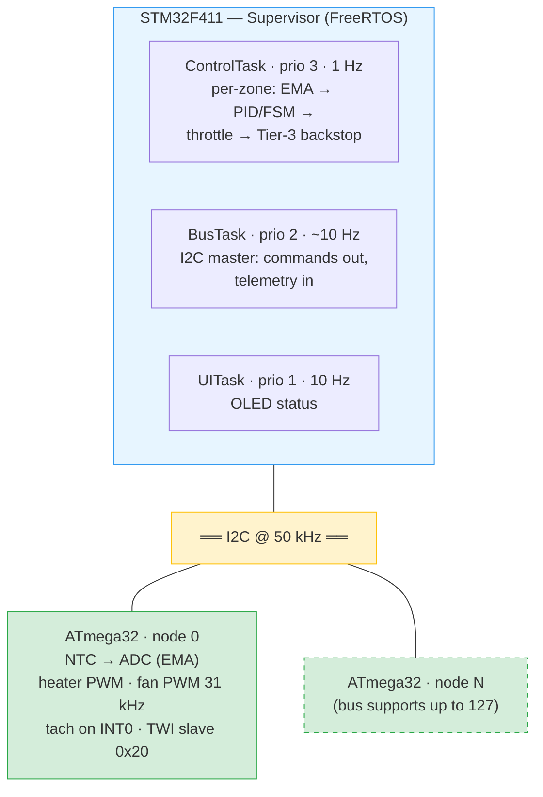
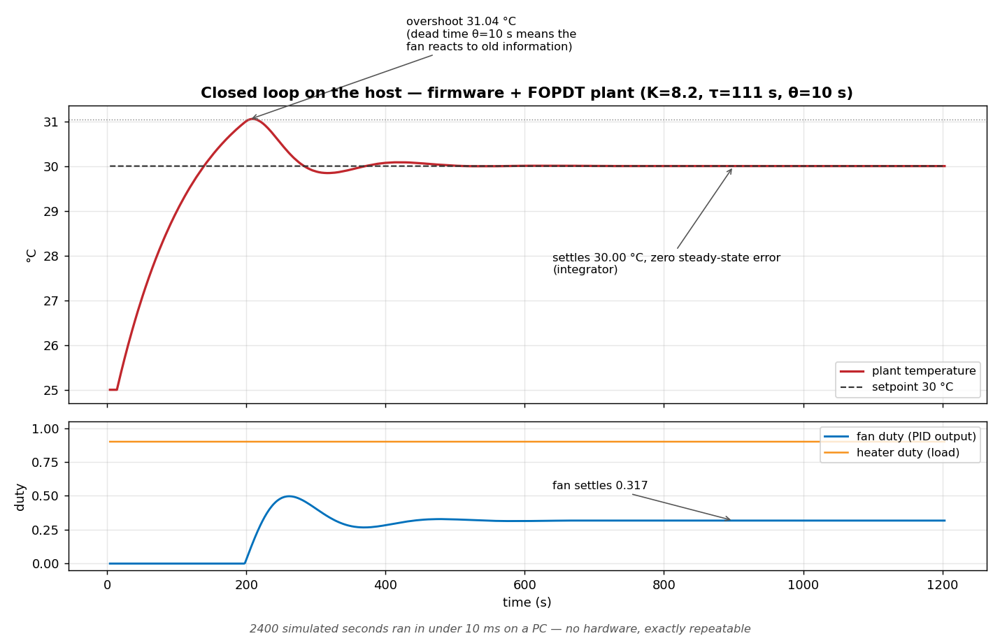
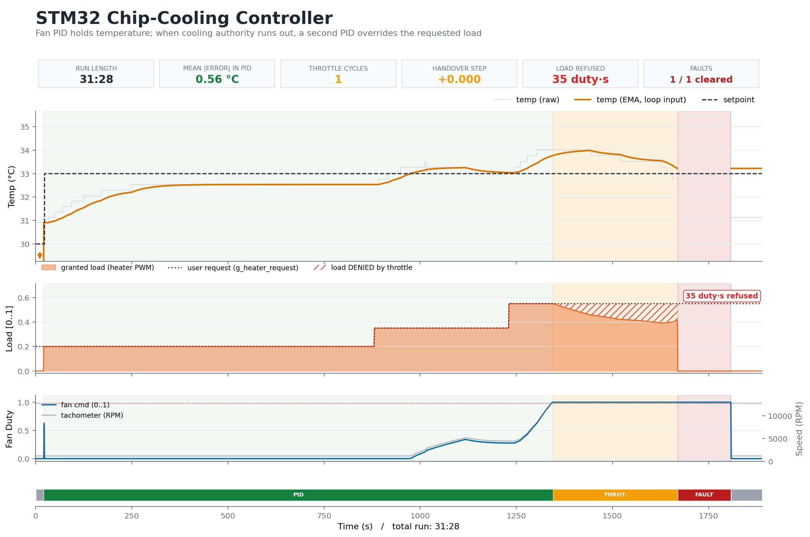

# Distributed Thermal BMC

**STM32F411 supervisor + ATmega32 zone nodes over I2C — a scaled-down
data-center thermal management brain.**

Each zone has a heater ("chip load"), a fan (the only closed-loop
actuator), and an NTC sensor. The supervisor runs per-zone PID with an
automatic load-throttle override: when a zone's fan saturates and
temperature stays high — for *any* reason: excess load, blocked airflow,
a dead fan — the system takes load away from the user, finds the maximum
sustainable level, and hands control back the moment cooling recovers.
The same philosophy as CPU thermal throttling: react to the *effect*,
not an enumerated list of causes.

**Status: multi-zone bring-up closed; control logic under host test.**
Single-zone controller: hardware-verified — see the run figures below.
Distributed layer (STM32 ↔ ATmega32 nodes): I2C bring-up closed with 9/9
clean poll cycles on the wire — see [Bring-up log](#bring-up-log). The
control logic now runs on a PC under a test harness, closed-loop against
a plant model identified from the real hardware.

---

## Project lineage

This project merges two earlier systems:

- **[DECS](https://github.com/mohammadrezasafaeian/Distributed-Environmental-Control-System-DECS-)**
  — the distributed topology: one master, ATmega32 zone nodes on a
  shared 2-wire bus (127 nodes max), web monitoring
- **Single-zone thermal controller** (this repo's early commits) — the
  control depth: SIMC-tuned PID from a measured plant, load-throttle
  override with bumpless transfer, safety FSM, `.noinit` black-box
  logging — verified on hardware

DECS proved the topology with hysteresis control; the thermal controller
proved the control engineering on one zone. This project puts real
control on the distributed topology.

---

## Architecture



**Division of labor:** nodes own the physical layer (sampling, PWM
generation, tach counting) and expose a 6-byte contract; the supervisor
owns all intelligence (control math, state machines, fault policy, UI).
Node firmware never makes a control decision.

### I2C data contracts

```c
/* master ← node : telemetry, 4 bytes */
typedef struct { uint16_t adc_raw; uint16_t tach_pulses; } I2C_Telemetry;

/* master → node : command, 2 bytes */
typedef struct { uint8_t heater_pwm; uint8_t fan_pwm; } I2C_Command;
```

`adc_raw` carries signed differential counts biased by +512 (contract A);
the supervisor subtracts the bias and decodes counts → R_ntc → °C. The
divider is ratiometric, so the reading is immune to rail sag.

---

## Control design — hardware-verified on the single-zone ancestor

| Layer | Mechanism |
|---|---|
| 1 — Fan PID | SIMC-tuned from a measured FOPDT plant (K ≈ 8.2 °C/duty, τ ≈ 111 s, θ ≈ 10 s); reverse-acting |
| 2 — Load throttle | Entry: fan saturated **and** temp above target, 5 s debounce. A second PID takes the heater with **bumpless transfer** — integrator seeded `I0 = u − Kp·e` from the *applied* output — finds max sustainable load, returns control when cooling recovers |
| 3 — Hard cutoff | Critical temp → heater off, fan max. Outside the FSM, unconditional |
| Sensor guard | NTC open/short detection in the count domain, debounced entry/exit, auto-recovery |

The `I0 = u − Kp·e` seed is itself a war story: the first implementation
seeded the integrator from the duty alone, and black-box data showed a
handover step of exactly `Kp·e` every time — the mathematical signature
of the missing proportional term. Logged data falsified the design; the
fix was verified on hardware with a +0.000 step.

### Verified hardware runs


*End-to-end run. Top: raw/filtered temperature vs. target. Middle:*
*user-requested vs. granted load — the hatched area is load the system*
***refused** in order to hold temperature. Bottom: fan command with the*
*FSM state strip.*


*Deliberate disturbance: the fan was physically moved away from the*
*heater (orange dashed). Fan command rails to 100 %, temperature stays*
*high; after debounce, the heater hands to the throttle PID with no*
*step at handover (bumpless transfer), and user load is pulled to a*
*sustainable level. Fan restored mid-cycle (green dashed): load returns*
*to the user's request and control returns to normal.*


*Left: FSM with live transition counts for this run. Right:*
*sensor-fault zoom — the node dropping off the I2C bus, heater cut*
*immediately, telemetry blanked while it was gone, debounced recovery.*

### Black-box logging

A full sample per second (raw/filtered temp, node voltage, commands,
requested vs. granted load) lands in a 2048-entry ring in a `.noinit`
linker section that survives watchdog and warm resets, plus a separate
event log. A Python toolchain renders debugger dumps into the annotated
reports shown above. Full-rate logging is kept for zone 0; the event log
covers all zones (a 2048-deep ring per zone would not fit the F411's
128 KB — measured with `arm-none-eabi-size`, not guessed).

---

## Host test harness

The control logic runs on a PC. No hardware, no flashing — the firmware's
own sources are compiled with the host compiler against fakes that stand
in for everything below the HAL.

```
cmake -B build && cmake --build build && ctest --test-dir build
```

```
1/3 Test #1: pid ......... Passed    (7 tests)
2/3 Test #2: nodes ....... Passed    (7 tests)
3/3 Test #3: loop ........ Passed    (7 tests)
100% tests passed out of 3   —   0.01 s
```

**The cut is at the HAL boundary**, not behind a new porting layer —
refactoring untested code first is the wrong order. `test/fakes` leads the
include path, so `#include "FreeRTOS.h"` resolves to the fake and the
firmware source is untouched.

| Fake | What it claims to be |
|---|---|
| clock | Owned by the test. `HAL_Delay` advances it instead of blocking, so a 30-minute scenario runs in milliseconds and log timestamps stay honest |
| tasks | Recorded, never started — the bodies are `for(;;)` loops |
| mutexes | Always succeed, take/give counted. Single-threaded means nothing to arbitrate; an unbalanced pair (a deadlock on target) becomes a number a test can assert on |
| queue | Real ring buffer. `ControlTask` `continue`s on a failed receive, so a queue that never delivers would spin forever |
| I2C | Scriptable: the test picks which nodes answer and what they report |

**Not modelled, deliberately:** preemption, priority inversion, races.
Those are real on the target and have to be found there. No fake register
file either — that only tests itself.

### Closed loop against the identified plant



FOPDT with the bench numbers — K = 8.2 °C/duty, τ = 111 s, θ = 10 s —
stepped at the 1 s control period. Dead time is a shift register of past
duty commands, not an average: the delay is what makes the loop
overshoot. Temperature enters the firmware as **raw counts over I2C**, so
the NTC decode stays under test; the inverse chain reproduces the bench
anchors independently (0 °C → 267 counts, 25 °C → 0).

2400 simulated seconds run in under 10 ms, exactly repeatable.

### What the harness found

- **`detect_fault()` trips `FR_FAN_OPEN` at power-up** if the tach reads
  under 300 rpm. The bench fan free-runs off its own rail so it never
  does — but there is no allowance for a fan starting from rest.
- **A regulation test that passed with the fan at zero.** 25 + 8.2×0.6 =
  29.92 against a 30 °C setpoint: the plant settled on its own and the
  controller was never exercised.
- **A noise test comparing two identical runs.** The loop was feeding the
  PID the plant temperature directly instead of the decoded counts, so
  the simulated ADC noise never reached the controller.

The last two were bugs in the tests, not the firmware — which is the
point. A green suite proves nothing until you break the code on purpose
and watch it go red.

### Model validation — simulation against hardware

The same scenario, replayed against the plant model on a PC and rendered by
the same parser. `test_sim_run` writes the firmware's own black-box binary
layout, so `parse_struct_dump.py` reads a simulated run exactly as it reads a
dump pulled over SWD — nothing in the reporting path is special-cased.



| KPI | Hardware | Simulation |
|---|---|---|
| Run length | 31:30 | 32:09 |
| Mean \|error\| in PID | 0.52 °C | 0.35 °C |
| Throttle cycles | 1 | 1 |
| **Handover step** | **+0.000** | **+0.000** |
| Load refused | 22 duty·s | 21 duty·s |
| Faults | 1/1 cleared | 1/1 cleared |

Same setpoints, same load steps, the same differential ADC path — °C to counts
to wire to decode, quantisation and ±1 LSB jitter included — and the same
node-offline fault that actually happened during bring-up.

What this does and does not establish: the plant constants come from one step
test, the airflow blockage is a scripted guess at a disturbance nobody
measured, and the ambient was read off the recording. The agreement worth
pointing at is the **handover step at +0.000 in both**, because that tests the
controller's bumpless transfer rather than the quality of the plant fit. The
mean error differs by 0.17 °C — the simulated sensor is quieter than the real
one, which is expected when the noise model is ±1 LSB of uniform jitter and
the bench has thermal drift, contact resistance and a fan that moves air
unevenly.

Doing this found a real bug in the model: `plant_step()` decayed toward the
compile-time ambient constant rather than the ambient the run was initialised
with, so any scenario not starting at 25 °C settled at the wrong temperature.
Invisible until a run was replayed at the actual bench ambient of 29.6 °C.

---

## Repository layout

```
Core/           STM32 application (FreeRTOS tasks, PID, FSM, logging)
zone1/          ATmega32 node firmware (CodeVisionAVR)
test/           host harness: Unity, fakes, plant model, three suites
scripts/        Python tooling: black-box report renderer, TWI debug parser
docs/           Figures
```

---

## Bring-up log

Honest record of the multi-zone bring-up, kept because the debugging
process is part of the engineering. **Closed** — 9/9 clean poll cycles on
the wire, node online with live telemetry. Three independent faults,
stacked:

- **Stale-build trap (CVAVR):** a hex built from stale sources produced
  a slave that ACKed at no address while the source was provably
  correct. Diagnosed by writing a bare-metal TWI *master* jig on the
  same chip — exonerating silicon, pins, clock, and bus in one shot.
- **Power-sequencing bus clamp:** an unpowered node's ESD diodes clamp
  SDA/SCL for every device on the bus — supervisor boot order matters,
  and a production BMC needs 9-pulse bus recovery + peripheral re-init
  (queued).
- **Transmit→receive turnaround race:** the master issued SLA+R faster
  than the slave's ISR could clear TWINT after the write's STOP. Writes
  were perfect, reads were never even seen. Found by streaming every TWI
  status byte out the node's UART into an STM32 RX ring read over SWD,
  with a Python parser reconstructing the transactions.

A fault in the *instrument* showed up along the way: the debug UART
itself corrupted at 3.3 V, because the ATmega's internal RC is calibrated
at 5 V. The impossible byte values (TWSR can only produce multiples of 8)
were the tell.

---

## Roadmap

- [x] Close I2C node bring-up
- [x] Host test harness — control logic runs and is asserted on a PC
- [ ] Fixed-point (Q15) port for a no-FPU target, with the harness as a
      float-vs-Q15 equivalence oracle
- [ ] Multi-zone hardware verification + recorded demo run
- [ ] Supervisor I2C bus recovery + OLED re-init on fault
- [ ] Atomic-access fixes (tach counter, telemetry stores) — flagged, staged
- [ ] Split `for(;;)` out of BusTask/ControlTask so tests stop duplicating them
- [ ] CAN transport for production reach (I2C is the demo bus; the DECS
      analysis applies: ~200-line driver swap, architecture unchanged)

---

*Mohammad Reza Safaeian —
[GitHub](https://github.com/mohammadrezasafaeian) ·
mohammad.rsafaeian@gmail.com*
