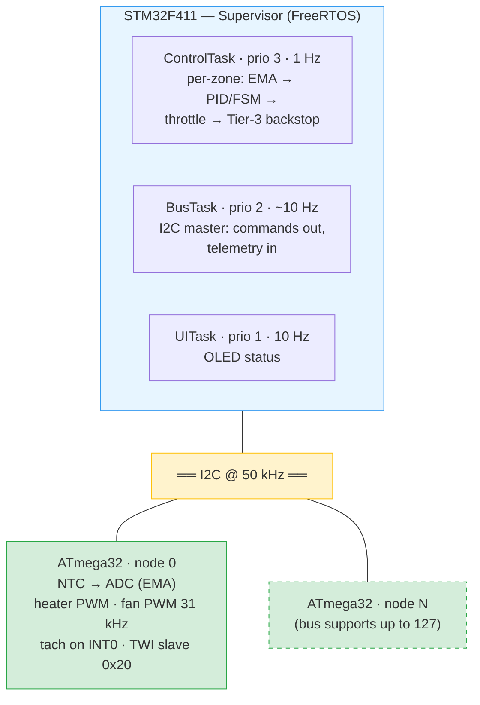
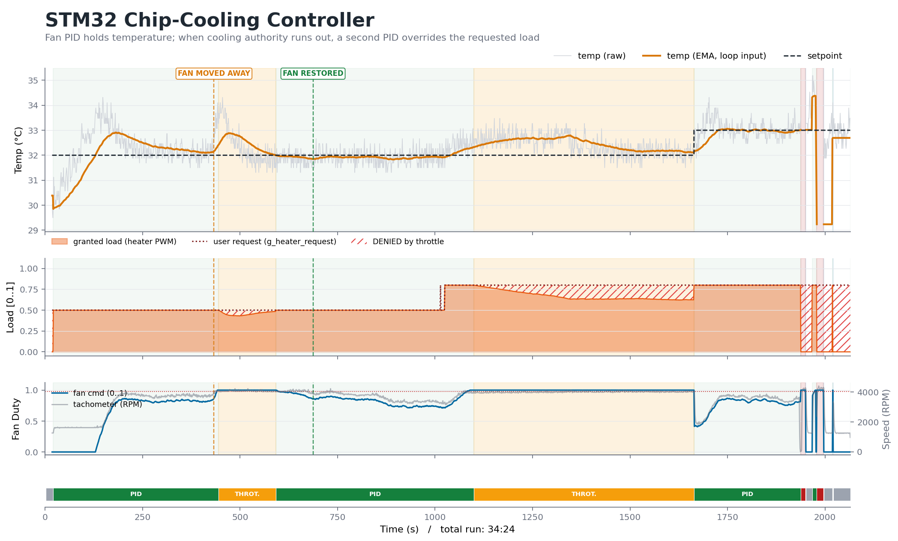
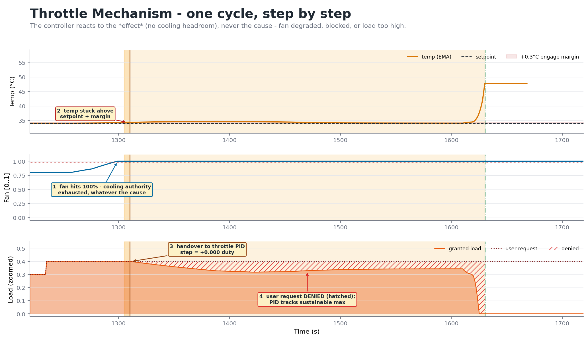
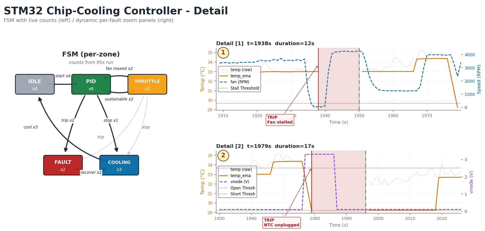

# Distributed Thermal BMC

**STM32F411 supervisor + ATmega32 zone nodes over I2C — a scaled-down
data-center thermal management brain.**

Each zone has a heater ("chip load"), a fan (the only closed-loop
actuator), and an NTC sensor. The supervisor runs per-zone PID with an
automatic load-throttle override: when a zone's fan saturates and
temperature stays high — for *any* reason: excess load, blocked airflow,
a dead fan — the system takes load away from the user, finds the maximum
sustainable level, and hands control back the moment cooling recovers.
The same philosophy as CPU thermal throttling: react to the *effect*,
not an enumerated list of causes.

**Status: multi-zone hardware bring-up in progress.**
Single-zone controller (this repo's early history): hardware-verified —
see the run figures below. Distributed layer (STM32 ↔ ATmega32 nodes):
code complete, I2C bring-up being debugged — see
[Bring-up log](#bring-up-log).

---

## Project lineage

This project merges two earlier systems:

- **[DECS](https://github.com/mohammadrezasafaeian/Distributed-Environmental-Control-System-DECS-)**
  — the distributed topology: one master, ATmega32 zone nodes on a
  shared 2-wire bus (127 nodes max), web monitoring
- **Single-zone thermal controller** (this repo's early commits) — the
  control depth: SIMC-tuned PID from a measured plant, load-throttle
  override with bumpless transfer, safety FSM, `.noinit` black-box
  logging — verified on hardware

DECS proved the topology with hysteresis control; the thermal controller
proved the control engineering on one zone. This project puts real
control on the distributed topology.

---

## Architecture



**Division of labor:** nodes own the physical layer (sampling, PWM
generation, tach counting) and expose a 6-byte contract; the supervisor
owns all intelligence (control math, state machines, fault policy, UI).
Node firmware never makes a control decision.

### I2C data contracts

```c
/* master ← node : telemetry, 4 bytes */
typedef struct { uint16_t adc_raw; uint16_t tach_pulses; } I2C_Telemetry;

/* master → node : command, 2 bytes */
typedef struct { uint8_t heater_pwm; uint8_t fan_pwm; } I2C_Command;
```

---

## Control design — hardware-verified on the single-zone ancestor

| Layer | Mechanism |
|---|---|
| 1 — Fan PID | SIMC-tuned from a measured FOPDT plant (K ≈ 8.2 °C/duty, τ ≈ 111 s, θ ≈ 10 s); reverse-acting |
| 2 — Load throttle | Entry: fan saturated **and** temp above target, 5 s debounce. A second PID takes the heater with **bumpless transfer** — integrator seeded `I0 = u − Kp·e` from the *applied* output — finds max sustainable load, returns control when cooling recovers |
| 3 — Hard cutoff | Critical temp → heater off, fan max. Outside the FSM, unconditional |
| Sensor guard | NTC open/short detection in the voltage domain, debounced entry/exit, auto-recovery |

### Verified hardware runs


*End-to-end run. Top: raw/filtered temperature vs. target. Middle:
user-requested vs. granted load — the hatched area is load the system
**refused** in order to hold temperature. Bottom: fan command with the
FSM state strip.*


*Deliberate disturbance: the fan was physically moved away from the
heater (orange dashed). Fan command rails to 100 %, temperature stays
high; after debounce, the heater hands to the throttle PID with no
step at handover (bumpless transfer), and user load is pulled to a
sustainable level. Fan restored mid-cycle (green dashed): load returns
to the user's request and control returns to normal.*


*Left: FSM with live transition counts for this run. Right:
sensor-fault zoom — NTC short, immediate heater cutoff, debounced
recovery after the fault clears.*

The `I0 = u − Kp·e` seed is itself a war story: the first implementation
seeded the integrator from the duty alone, and black-box data showed a
handover step of exactly `Kp·e` every time — the mathematical signature
of the missing proportional term. Logged data falsified the design; the
fix was verified on hardware with a +0.000 step.

### Black-box logging

A full sample per second (raw/filtered temp, node voltage, commands,
requested vs. granted load) lands in a 2048-entry ring in a `.noinit`
linker section that survives watchdog and warm resets, plus a separate
event log. A Python toolchain renders debugger dumps into the annotated
reports shown above. Full-rate logging is kept for zone 0; the event log
covers all zones (a 2048-deep ring per zone would not fit the F411's
128 KB — measured with `arm-none-eabi-size`, not guessed).

---

## Repository layout

```
Core/           STM32 application (FreeRTOS tasks, PID, FSM, logging)
zone1/          ATmega32 node firmware (CodeVisionAVR)
scripts/        Python tooling: black-box report renderer, TWI debug parser
docs/           Figures
```

---

## Bring-up log

Honest record of the multi-zone bring-up, kept because the debugging
process is part of the engineering:

- **Stale-build trap (CVAVR):** a hex built from stale sources produced
  a slave that ACKed at no address while the source was provably
  correct. Diagnosed by writing a bare-metal TWI *master* jig on the
  same chip — exonerating silicon, pins, clock, and bus in one shot.
- **Power-sequencing bus clamp:** an unpowered node's ESD diodes clamp
  SDA/SCL for every device on the bus — supervisor boot order matters,
  and a production BMC needs 9-pulse bus recovery + peripheral re-init
  (queued).
- **Debug channel:** the node streams every TWI status byte (TWSR) out
  its UART into an STM32 RX ring read over SWD; a Python parser
  reconstructs transactions and classifies frames. Current finding: the
  UART link itself corrupts at 3.3 V (internal-RC baud drift suspected)
  — being characterized with a known-plaintext capture before the TWI
  capture can be trusted.

*This section will be replaced by verified multi-zone results when the
bring-up closes.*

---

## Roadmap

- [ ] Close I2C node bring-up (in progress)
- [ ] Multi-zone hardware verification + recorded demo run
- [ ] Supervisor I2C bus recovery + OLED re-init on fault
- [ ] Atomic-access fixes (tach counter, telemetry stores) — flagged, staged
- [ ] CAN transport for production reach (I2C is the demo bus; the DECS
      analysis applies: ~200-line driver swap, architecture unchanged)

---

*Mohammad Reza Safaeian —
[GitHub](https://github.com/mohammadrezasafaeian) ·
mohammad.rsafaeian@gmail.com*

